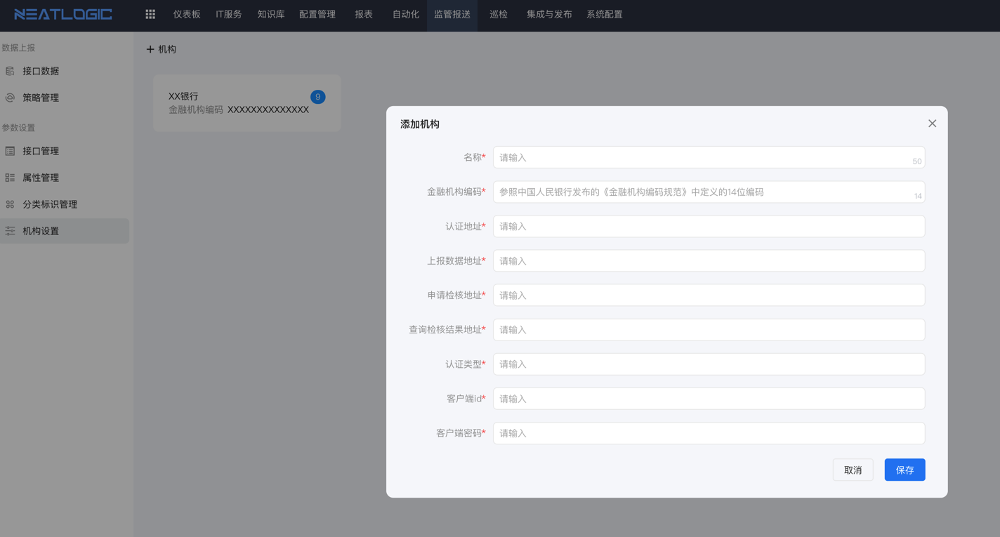
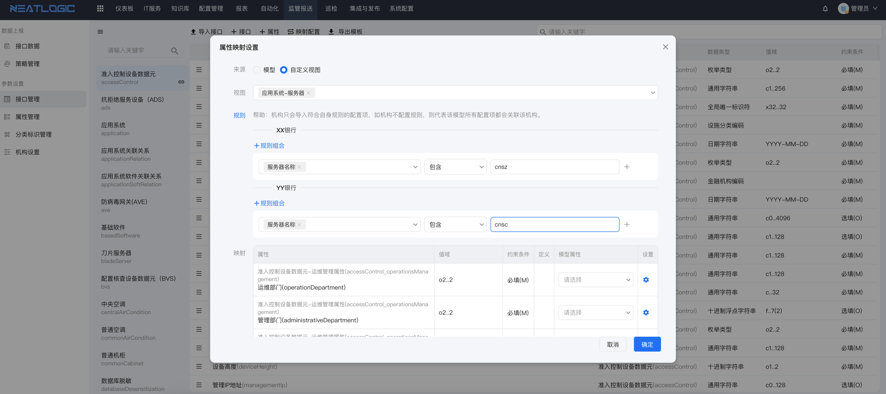
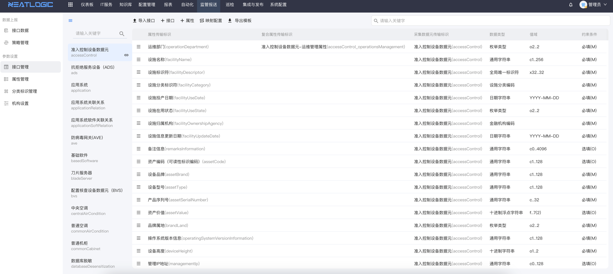
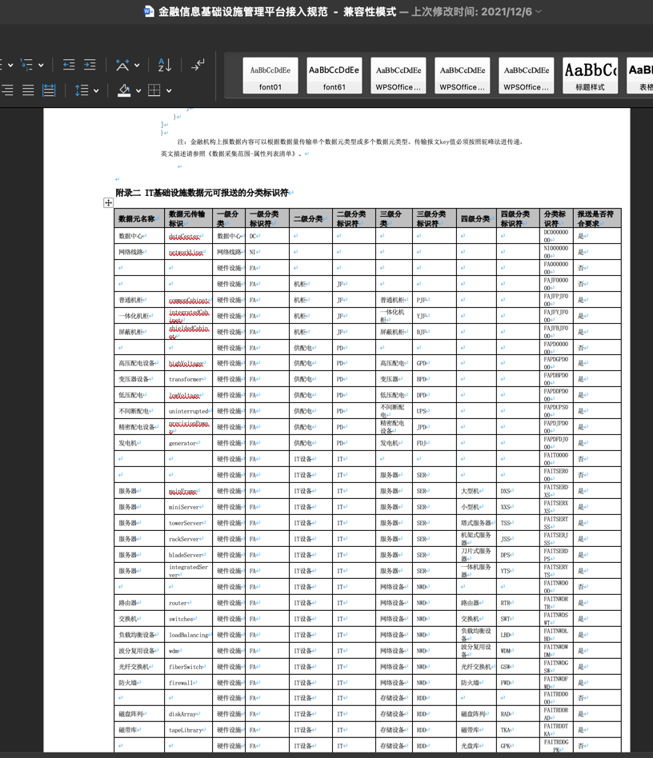
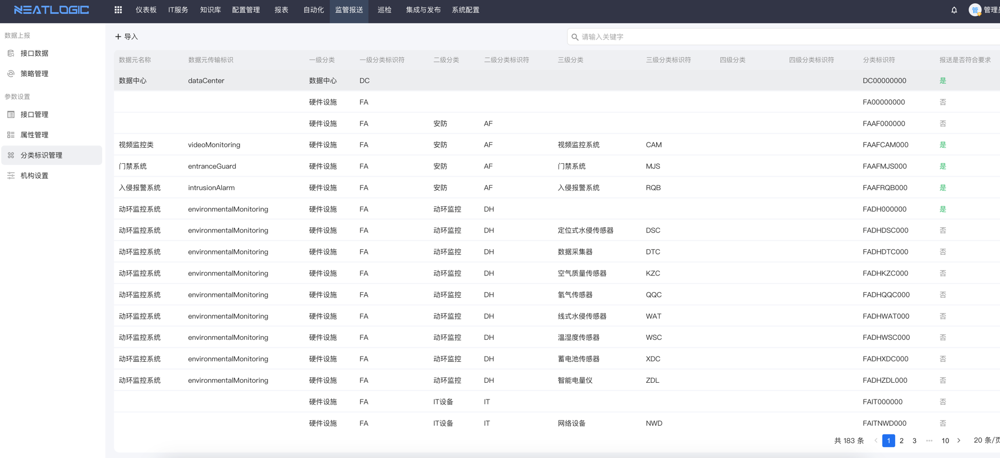
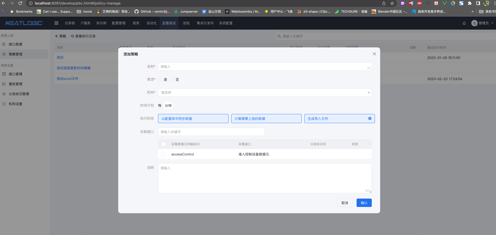
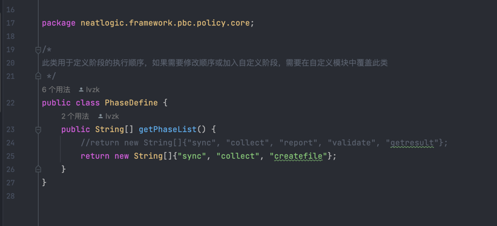

## 关于

neatlogic-pbc能帮助用户根据《金融信息基础设施管理平台接入规范》的要求上报数据，如果使用neatlogic-cmdb，可以通过策略定时抽取数据并上报，也可以脱离neatlogic-cmdb自行录入上报。支持通过扩展模块覆盖内部上报流程，实现个性化上报。

## 主要功能

### 多机构模式

- 集团用户可能拥有多个金融机构，支持通过配置策略，根据规则把数据上报到不同的金融机构名下。
  
  

### 自动识别模板数据

- 把《金融信息基础设施管理平台数据采集范围-属性清单列表》的"采集清单"部分抽出另存为新的excel，可以直接上传所有接口、属性和枚举定义。
  
  
- 把《金融信息基础设施管理平台接入规范》中的分类标识符复制另存为新的excel，可以直接上传分类标识符定义。
  
  

### 自定义同步策略

- 系统根据上报要求把上报分成同步、计算、校验、上报和获取结果5个阶段，如果用户需要调整可以通过定制模块的方式覆盖阶段定义，自行编写阶段处理类来实现个性化上报。
  
- PhaseDefine类用于定义上报阶段及其顺序，覆盖了PhaseDefine后，可继承PhaseHandlerBase类实现个性化处理逻辑。
  